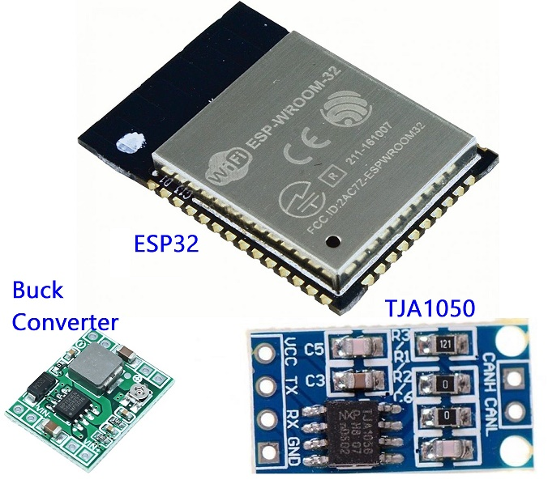
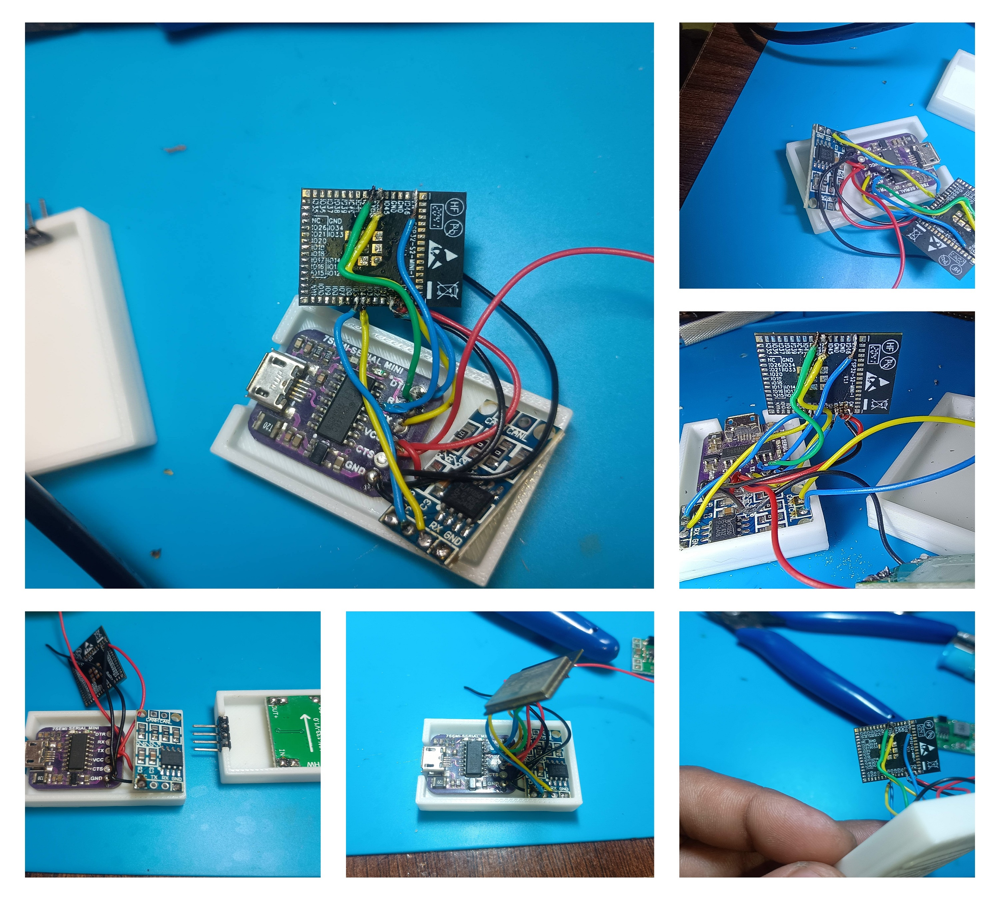
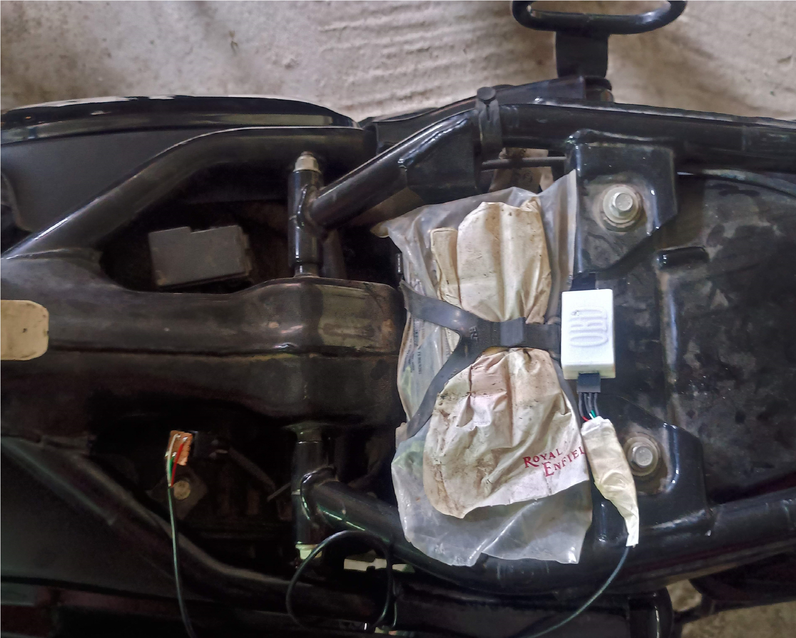
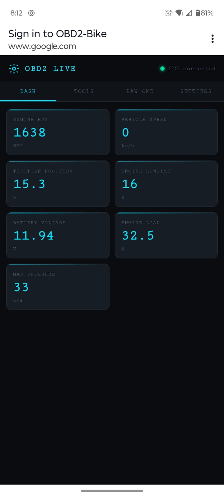
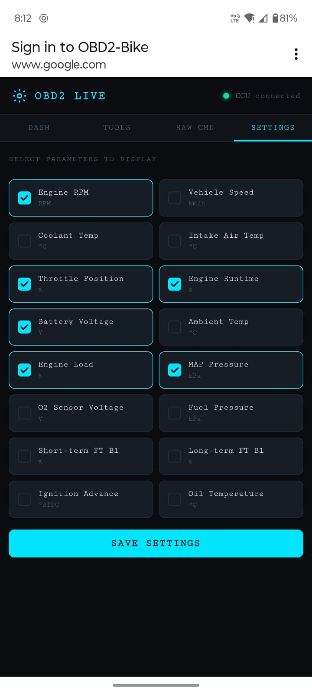
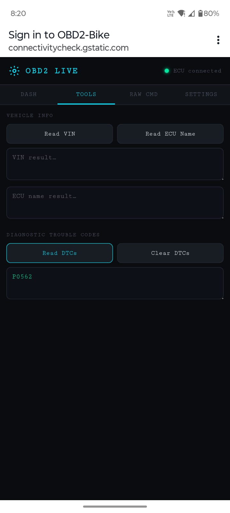
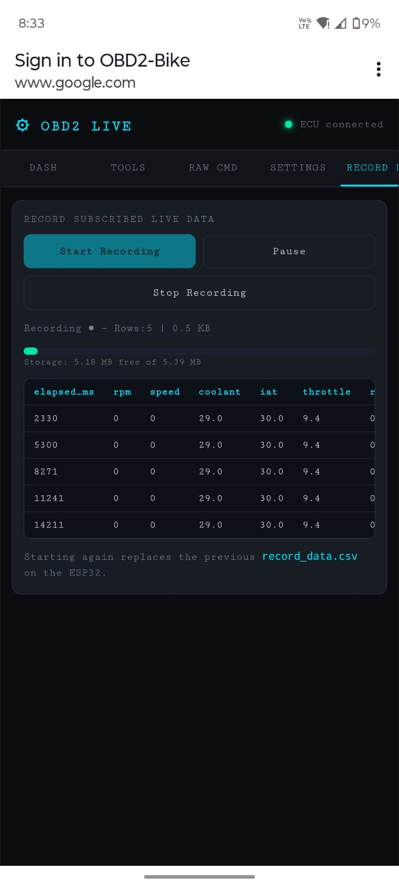
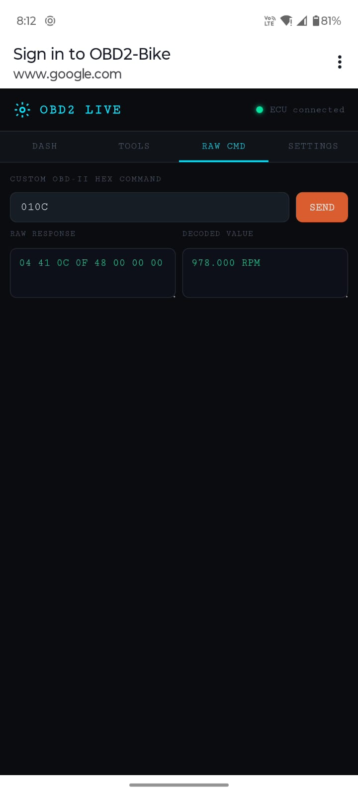

# ESP32 OBD2 Scanner for Bikes & Cars

> A custom OBD2 diagnostic device built with an ESP32 and TJA1050 CAN transceiver, serving a real-time live dashboard over Wi-Fi and BLE, including a companion Android app.

## Features

* ✅ Wi-Fi Web Dashboard
* ✅ BLE Notifications
* ✅ Android App
* ✅ CSV Data Recording
* ✅ DTC Read / Clear
* ✅ VIN Reading
* ✅ Raw OBD2 Command Mode
* ✅ ESP32 + TJA1050 Hardware

---

# Project Journey

## Phase 1 — Learning (ELM327 + Serial Debug)

Started by purchasing an ELM327 Mini Bluetooth adapter and communicating with it using a Serial Debug Assistant on Windows.

Learned:

* AT Commands
* OBD2 Modes
* PID Requests
* DTC Reading
* RPM / Speed Decoding
* Raw CAN Data Structure

---

## Phase 2 — Hardware Design

Built a custom scanner using:

### Components

| Component      | Purpose             |
| -------------- | ------------------- |
| ESP32          | Main Controller     |
| TJA1050        | CAN Bus Transceiver |
| OBD2 Connector | Vehicle Interface   |
| LED            | Status Indicator    |

### GPIO Connections

| ESP32  | TJA1050 |
| ------ | ------- |
| GPIO 5 | TXD     |
| GPIO 4 | RXD     |
| GND    | GND     |

CAN Bus:

| OBD2 Pin | Signal |
| -------- | ------ |
| 6        | CAN-H  |
| 14       | CAN-L  |
| 4/5      | Ground |
| 16       | +12V   |

---

## Phase 3 — Wi-Fi Dashboard Firmware

Implemented:

* ESP32 Access Point
* Embedded Web Server
* Live Dashboard
* JSON API
* CSV Recording
* DTC Read/Clear
* VIN Reading via ISO-TP

---

## Phase 4 — BLE Firmware & Android App

Implemented:

* BLE GATT Server
* Notify Characteristics
* Android Companion App

Functions:

* Live Gauges
* VIN Reading
* DTC Reading
* DTC Clearing
* Real-Time Updates

---

# How It Works

```text
Vehicle ECU
    │
    ▼
TJA1050 CAN Transceiver
    │
    ▼
ESP32
    │
    ├── Wi-Fi Dashboard
    │     ├── JSON API
    │     ├── Live Gauges
    │     └── CSV Recording
    │
    └── BLE Server
          ├── Live Notifications
          ├── VIN
          └── DTC Data
```

---

# OBD2 Request Example

Request Engine RPM:

```text
TX Frame (0x7DF)

02 01 0C 00 00 00 00 00
```

Response:

```text
RX Frame (0x7E8)

04 41 0C 1A F8 00 00 00
```

Calculation:

```text
RPM = (256 × 0x1A + 0xF8) / 4
RPM = 1726
```

---

# Circuit Diagram


---

# Pin Summary

| Connection | From          | To           |
| ---------- | ------------- | ------------ |
| CAN-H      | OBD2 Pin 6    | TJA1050 CANH |
| CAN-L      | OBD2 Pin 14   | TJA1050 CANL |
| CAN TX     | GPIO 5        | TJA1050 TXD  |
| CAN RX     | GPIO 4        | TJA1050 RXD  |
| RS         | GND           | TJA1050 RS   |
| VCC        | 5V            | TJA1050 VCC  |
| GND        | Common Ground | All Devices  |
| LED        | GPIO 17       | LED + 220Ω   |

> **Note:** TJA1050 requires a 5V supply.

---

# Hardware Build

## Components



## Wiring



## Final Device


## Bike Connection



---

# Wi-Fi Dashboard

## Features

* Access Point Mode
* Real-Time Gauges
* DTC Reader
* CSV Recording
* VIN Reader
* Raw Command Terminal

---

## Connection Steps

### 1. Plug in the Scanner

Connect the scanner to the OBD2 port.

### 2. Connect to Wi-Fi

SSID:

```text
OBD2-Bike
```

Password:

```text
12345678
```

### 3. Open Dashboard

```text
http://192.168.4.1
```

or

```text
http://obd.local
```

### 4. Select Parameters

Choose desired PIDs in Settings.

### 5. Monitor Live Data

View gauges updating every second.

---

# Dashboard Screenshots

## Dashboard



## Settings



## DTC Tools



## Data Recording



## Raw Command Mode



---

# Video Demonstration

[▶ Watch Demo Video](https://youtube.com/shorts/QEk9EGT3YsI)

---

# Supported OBD2 Parameters

| Parameter         | PID  | Formula        | Unit   |
| ----------------- | ---- | -------------- | ------ |
| Engine RPM        | 0x0C | (256A+B)/4     | RPM    |
| Vehicle Speed     | 0x0D | A              | km/h   |
| Coolant Temp      | 0x05 | A-40           | °C     |
| Intake Temp       | 0x0F | A-40           | °C     |
| Throttle Position | 0x11 | A×100/255      | %      |
| Runtime           | 0x1F | A×256+B        | sec    |
| Battery Voltage   | 0x42 | (A×256+B)/1000 | V      |
| Ambient Temp      | 0x46 | A-40           | °C     |
| Engine Load       | 0x04 | A×100/255      | %      |
| MAP Pressure      | 0x0B | A              | kPa    |
| O2 Voltage        | 0x14 | A×0.005        | V      |
| Fuel Pressure     | 0x0A | A×3            | kPa    |
| STFT              | 0x06 | (A/128−1)×100  | %      |
| LTFT              | 0x07 | (A/128−1)×100  | %      |
| Ignition Advance  | 0x0E | A/2−64         | ° BTDC |
| Oil Temperature   | 0x5C | A−40           | °C     |

> Not all ECUs support every PID.

---

# ELM327 Guide

For ELM327 AT command documentation:

📖 **[ELM327 AT Command Mode](obd2_guide.html)**

---

# Author

Built as a learning project to understand:

* CAN Bus
* OBD2 Protocol
* ISO-TP
* ESP32 Networking
* BLE GATT
* Embedded Web Applications
* Automotive Diagnostics

From protocol analysis → custom hardware → firmware → Android application.
